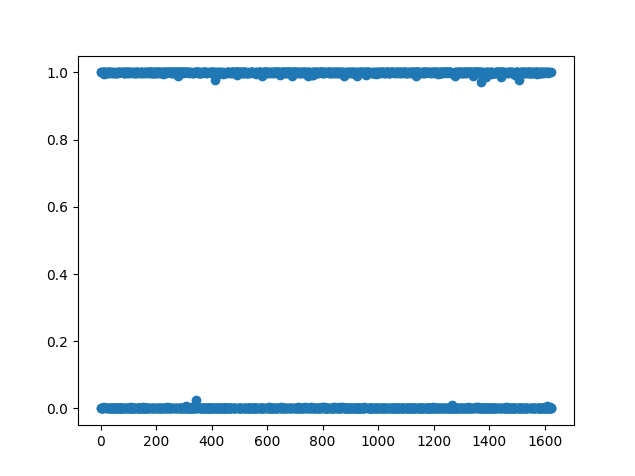

# ACM Research Coding Challenge (Spring 2022)

I used a logistic regression model with the scikit-learn library in python. The file `parse.py`
handles the conversion of the csv dataset into integer arrays that can be used to train and test
the network. The model immediately achieved 100% accuracy, which I thought meant something was
probably wrong. I tried implementing a simple logistic regression model with pytorch, with a single
sigmoid layer and BCE loss, and interestingly it had less than 100% accuracy. This meant it was
likely just that scikit-learn's default implementation of logistic regression was good enough to
identify a straightforward correlation with the features and whether or not the mushroom is
poisonous.

To be certain, I tried plotting the predicted probabilities on the test set, and the chart showed
that the model was always highly confident in its predictions. The predictions also matched the
targets specified in the dataset, so the accuracy was 100%. Here's a screenshot of the predictions:

Since the correlation seemed fairly straightforward, I also tried other models like decision trees,
and it still performed just as well. I chose to submit the one with logistic regression just because
I felt like it didn't really matter, and it is in general a good approach to binary classification
problems.
